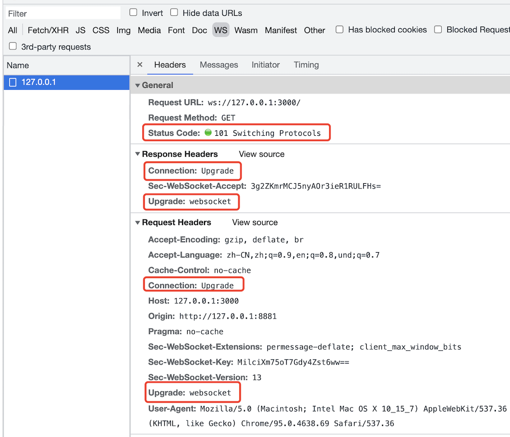
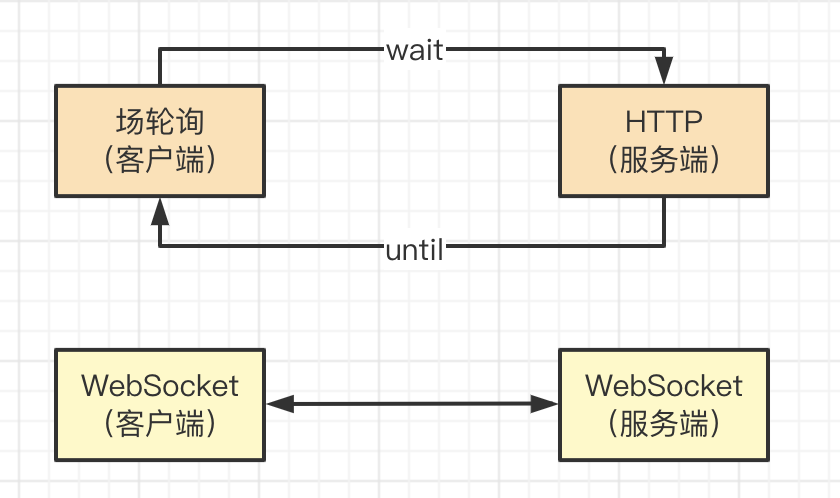

# webSocket

## 题目

webSocket 和 http 协议有何区别？有和应用场景？

## webSocket 简介

webSocket 和 http 都是应用层，支持端对端的通讯。可以由服务端发起，也可以由客户端发起。<br>
代码参考 ws-server 中 webSocket1.html webSocket2.html

场景：消息通知，直播讨论区，聊天室，协同编辑

```js
//ws-server
const { WebSocketServer } = require('ws')

const wsServer = new WebSocketServer({ port: 3000 })

const list = new Set()

wsServer.on('connection', curWs => {
    console.info('connected')

    // 这里，不能一直被 add 。实际使用中，这里应该有一些清理缓存的机制，长期用不到的 ws 要被 delete
    list.add(curWs)

    curWs.on('message', msg => {
        console.info('received message', msg.toString())

        // 传递给其他客户端
        list.forEach(ws => {
            if (ws === curWs) return
            ws.send(msg.toString())
        })
    })
})
```
```html
<!--web-socket-p2p-1.html-->
<!DOCTYPE html>
<html lang="en">
<head>
    <meta charset="UTF-8">
    <meta http-equiv="X-UA-Compatible" content="IE=edge">
    <meta name="viewport" content="width=device-width, initial-scale=1.0">
    <title>websocket</title>
</head>
<body>
    <p>websocket page 1</p>
    <button id="btn-send">发送消息</button>

    <script>
        const ws = new WebSocket('ws://127.0.0.1:3000')
        ws.onopen = () => {
            console.info('opened')
            ws.send('client1 opened')
        }
        ws.onmessage = event => {
            console.info('client1 received', event.data)
        }

        const btnSend = document.getElementById('btn-send')
        btnSend.addEventListener('click', () => {
            console.info('clicked')
            ws.send('client1 time is ' + Date.now())
        })
    </script>
</body>
</html>
```
```html
<!--web-socket-p2p-2.html-->
<!DOCTYPE html>
<html lang="en">
<head>
    <meta charset="UTF-8">
    <meta http-equiv="X-UA-Compatible" content="IE=edge">
    <meta name="viewport" content="width=device-width, initial-scale=1.0">
    <title>websocket</title>
</head>
<body>
    <p>websocket page 2</p>
    <button id="btn-send">发送消息</button>

    <script>
        const ws = new WebSocket('ws://127.0.0.1:3000')
        ws.onopen = () => {
            console.info('opened')
            ws.send('client2 opened')
        }
        ws.onmessage = event => {
            console.info('client2 received', event.data)
        }

        const btnSend = document.getElementById('btn-send')
        btnSend.addEventListener('click', () => {
            console.info('clicked')
            ws.send('client2 time is ' + Date.now())
        })
    </script>
</body>
</html>
```
## webSocket 建立连接

会先发起一个 http 请求，根服务端建立连接。连接成功之后再升级为 webSocket 协议，然后再通讯。



## webSocket 和 http 区别

- 协议名称不同 `ws` 和 `http`
- http 一般只能浏览器发起请求，webSocket 可以双端发起请求
- webSocket 无跨域限制
- webSocket 通过 `send` 和 `onmessage` 进行通讯，http 通过 `req` 和 `res` 通讯

PS：`ws` 可以升级为 `wss` 协议，像 `http` 升级到 `https` 一样，增加 `SSL` 安全协议。

```js
import { createServer } from 'https'
import { readFileSync } from 'fs'
import { WebSocketServer } from 'ws'

const server = createServer({
  cert: readFileSync('/path/to/cert.pem'),
  key: readFileSync('/path/to/key.pem')
})
const wss = new WebSocketServer({ server })
```

## 扩展

PS：如果做项目开发，推荐使用 [socket.io](https://www.npmjs.com/package/socket.io)，API 更方便。

```js
io.on('connection', socket => {
  // emit an event to the socket
  socket.emit('request', /* … */)
  // emit an event to all connected sockets
  io.emit('broadcast', /* … */)
  // listen to the event
  socket.on('reply', () => { /* … */ })
})
```

## 连环问：webSocket 和长轮询（长连接）的区别

- http 长轮询 - 客户端发起 http 请求，server 不立即返回，等待有结果再返回。这期间 TCP 连接不会关闭，阻塞式。（需要处理 timeout 的情况）
- webSocket - 客户端发起请求，服务端接收，连接关闭。服务端发起请求，客户端接收，连接关闭。非阻塞。


