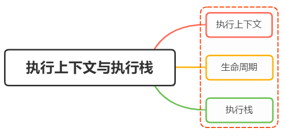

# 面试官：JavaScript中执行上下文和执行栈是什么？




## 一、执行上下文

简单的来说，执行上下文是一种对`Javascript`代码执行环境的抽象概念，也就是说只要有`Javascript`代码运行，那么它就一定是运行在执行上下文中

执行上下文的类型分为三种：

- 全局执行上下文：只有一个，浏览器中的全局对象就是 `window `对象，`this` 指向这个全局对象
- 函数执行上下文：存在无数个，只有在函数被调用的时候才会被创建，每次调用函数都会创建一个新的执行上下文
- Eval 函数执行上下文： 指的是运行在 `eval` 函数中的代码，很少用而且不建议使用

下面给出全局上下文和函数上下文的例子：

 

紫色框住的部分为全局上下文，蓝色和橘色框起来的是不同的函数上下文。只有全局上下文（的变量）能被其他任何上下文访问

可以有任意多个函数上下文，每次调用函数创建一个新的上下文，会创建一个私有作用域，函数内部声明的任何变量都不能在当前函数作用域外部直接访问


## 二、生命周期

执行上下文的生命周期包括三个阶段：创建阶段 → 执行阶段 → 回收阶段

### 创建阶段

创建阶段即当函数被调用，但未执行任何其内部代码之前

创建阶段做了三件事：

- 确定 this 的值，也被称为 `This Binding`
- LexicalEnvironment（词法环境） 组件被创建
- VariableEnvironment（变量环境） 组件被创建

伪代码如下：

```js
ExecutionContext = {  
  ThisBinding = <this value>,     // 确定this 
  LexicalEnvironment = { ... },   // 词法环境
  VariableEnvironment = { ... },  // 变量环境
}
```


#### This Binding

确定`this`的值我们前面讲到，`this`的值是在执行的时候才能确认，定义的时候不能确认


#### 词法环境

词法环境有两个组成部分：

- 全局环境：是一个没有外部环境的词法环境，其外部环境引用为` null`，有一个全局对象，`this` 的值指向这个全局对象

- 函数环境：用户在函数中定义的变量被存储在环境记录中，包含了`arguments` 对象，外部环境的引用可以是全局环境，也可以是包含内部函数的外部函数环境

伪代码如下：

```js
GlobalExectionContext = {  // 全局执行上下文
  LexicalEnvironment: {       // 词法环境
    EnvironmentRecord: {     // 环境记录
      Type: "Object",           // 全局环境
      // 标识符绑定在这里 
      outer: <null>           // 对外部环境的引用
  }  
}

FunctionExectionContext = { // 函数执行上下文
  LexicalEnvironment: {     // 词法环境
    EnvironmentRecord: {    // 环境记录
      Type: "Declarative",      // 函数环境
      // 标识符绑定在这里      // 对外部环境的引用
      outer: <Global or outer function environment reference>  
  }  
}
```


#### 变量环境

变量环境也是一个词法环境，因此它具有上面定义的词法环境的所有属性

在 ES6 中，词法环境和变量环境的区别在于前者用于存储函数声明和变量（ `let` 和 `const` ）绑定，而后者仅用于存储变量（ `var` ）绑定

举个例子

```js
let a = 20;  
const b = 30;  
var c;

function multiply(e, f) {  
 var g = 20;  
 return e * f * g;  
}

c = multiply(20, 30);
```

执行上下文如下：

```js
GlobalExectionContext = {

  ThisBinding: <Global Object>,

  LexicalEnvironment: {  // 词法环境
    EnvironmentRecord: {  
      Type: "Object",  
      // 标识符绑定在这里  
      a: < uninitialized >,  
      b: < uninitialized >,  
      multiply: < func >  
    }  
    outer: <null>  
  },

  VariableEnvironment: {  // 变量环境
    EnvironmentRecord: {  
      Type: "Object",  
      // 标识符绑定在这里  
      c: undefined,  
    }  
    outer: <null>  
  }  
}

FunctionExectionContext = {  
   
  ThisBinding: <Global Object>,

  LexicalEnvironment: {  
    EnvironmentRecord: {  
      Type: "Declarative",  
      // 标识符绑定在这里  
      Arguments: {0: 20, 1: 30, length: 2},  
    },  
    outer: <GlobalLexicalEnvironment>  
  },

  VariableEnvironment: {  
    EnvironmentRecord: {  
      Type: "Declarative",  
      // 标识符绑定在这里  
      g: undefined  
    },  
    outer: <GlobalLexicalEnvironment>  
  }  
}
```

留意上面的代码，`let`和`const`定义的变量`a`和`b`在创建阶段没有被赋值，但`var`声明的变量从在创建阶段被赋值为`undefined`

这是因为，创建阶段，会在代码中扫描变量和函数声明，然后将函数声明存储在环境中

但变量会被初始化为`undefined`(`var`声明的情况下)和保持`uninitialized`(未初始化状态)(使用`let`和`const`声明的情况下)

这就是变量提升的实际原因


### 执行阶段

在这阶段，执行变量赋值、代码执行

如果 `Javascript` 引擎在源代码中声明的实际位置找不到变量的值，那么将为其分配 `undefined` 值


### 回收阶段

执行上下文出栈等待虚拟机回收执行上下文


## 二、执行栈

执行栈，也叫调用栈，具有 LIFO（后进先出）结构，用于存储在代码执行期间创建的所有执行上下文

 

当`Javascript`引擎开始执行你第一行脚本代码的时候，它就会创建一个全局执行上下文然后将它压到执行栈中

每当引擎碰到一个函数的时候，它就会创建一个函数执行上下文，然后将这个执行上下文压到执行栈中

引擎会执行位于执行栈栈顶的执行上下文(一般是函数执行上下文)，当该函数执行结束后，对应的执行上下文就会被弹出，然后控制流程到达执行栈的下一个执行上下文

举个例子：

```js
let a = 'Hello World!';
function first() {
  console.log('Inside first function');
  second();
  console.log('Again inside first function');
}
function second() {
  console.log('Inside second function');
}
first();
console.log('Inside Global Execution Context');
```

转化成图的形式

 

简单分析一下流程：

- 创建全局上下文请压入执行栈
- `first`函数被调用，创建函数执行上下文并压入栈
- 执行`first`函数过程遇到`second`函数，再创建一个函数执行上下文并压入栈
- `second`函数执行完毕，对应的函数执行上下文被推出执行栈，执行下一个执行上下文`first`函数
- `first`函数执行完毕，对应的函数执行上下文也被推出栈中，然后执行全局上下文
- 所有代码执行完毕，全局上下文也会被推出栈中，程序结束


## 参考文献

- https://zhuanlan.zhihu.com/p/107552264