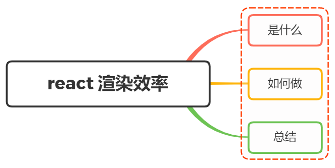

# 面试官：说说你是如何提高组件的渲染效率的？在React中如何避免不必要的render？

 


## 一、是什么

`react` 基于虚拟 `DOM` 和高效 `Diff `算法的完美配合，实现了对 `DOM `最小粒度的更新，大多数情况下，`React `对 `DOM `的渲染效率足以我们的业务日常

复杂业务场景下，性能问题依然会困扰我们。此时需要采取一些措施来提升运行性能，避免不必要的渲染则是业务中常见的优化手段之一


## 二、如何做

在之前文章中，我们了解到`render`的触发时机，简单来讲就是类组件通过调用`setState`方法， 就会导致`render`，父组件一旦发生`render`渲染，子组件一定也会执行`render`渲染

从上面可以看到，父组件渲染导致子组件渲染，子组件并没有发生任何改变，这时候就可以从避免无谓的渲染，具体实现的方式有如下：

- shouldComponentUpdate
- PureComponent
- React.memo


### shouldComponentUpdate

通过`shouldComponentUpdate`生命周期函数来比对 `state `和 `props`，确定是否要重新渲染

默认情况下返回`true`表示重新渲染，如果不希望组件重新渲染，返回 `false` 即可


### PureComponent

跟`shouldComponentUpdate `原理基本一致，通过对 `props` 和 `state`的浅比较结果来实现 `shouldComponentUpdate`，源码大致如下：

```js
if (this._compositeType === CompositeTypes.PureClass) {
    shouldUpdate = !shallowEqual(prevProps, nextProps) || ! shallowEqual(inst.state, nextState);
}
```

`shallowEqual`对应方法大致如下：

```js
const hasOwnProperty = Object.prototype.hasOwnProperty;

/**
 * is 方法来判断两个值是否是相等的值，为何这么写可以移步 MDN 的文档
 * https://developer.mozilla.org/zh-CN/docs/Web/JavaScript/Reference/Global_Objects/Object/is
 */
function is(x: mixed, y: mixed): boolean {
  if (x === y) {
    return x !== 0 || y !== 0 || 1 / x === 1 / y;
  } else {
    return x !== x && y !== y;
  }
}

function shallowEqual(objA: mixed, objB: mixed): boolean {
  // 首先对基本类型进行比较
  if (is(objA, objB)) {
    return true;
  }

  if (typeof objA !== 'object' || objA === null ||
      typeof objB !== 'object' || objB === null) {
    return false;
  }

  const keysA = Object.keys(objA);
  const keysB = Object.keys(objB);

  // 长度不相等直接返回false
  if (keysA.length !== keysB.length) {
    return false;
  }

  // key相等的情况下，再去循环比较
  for (let i = 0; i < keysA.length; i++) {
    if (
      !hasOwnProperty.call(objB, keysA[i]) ||
      !is(objA[keysA[i]], objB[keysA[i]])
    ) {
      return false;
    }
  }

  return true;
}
```

当对象包含复杂的数据结构时，对象深层的数据已改变却没有触发 `render`

注意：在`react`中，是不建议使用深层次结构的数据


### React.memo

`React.memo`用来缓存组件的渲染，避免不必要的更新，其实也是一个高阶组件，与 `PureComponent` 十分类似。但不同的是， `React.memo` 只能用于函数组件

```jsx
import { memo } from 'react';

function Button(props) {
  // Component code
}

export default memo(Button);
```

如果需要深层次比较，这时候可以给`memo`第二个参数传递比较函数

```jsx
function arePropsEqual(prevProps, nextProps) {
  // your code
  return prevProps === nextProps;
}

export default memo(Button, arePropsEqual);
```


## 三、总结

在实际开发过程中，前端性能问题是一个必须考虑的问题，随着业务的复杂，遇到性能问题的概率也在增高

除此之外，建议将页面进行更小的颗粒化，如果一个过大，当状态发生修改的时候，就会导致整个大组件的渲染，而对组件进行拆分后，粒度变小了，也能够减少子组件不必要的渲染


## 参考文献

- https://juejin.cn/post/6844903781679759367#heading-12