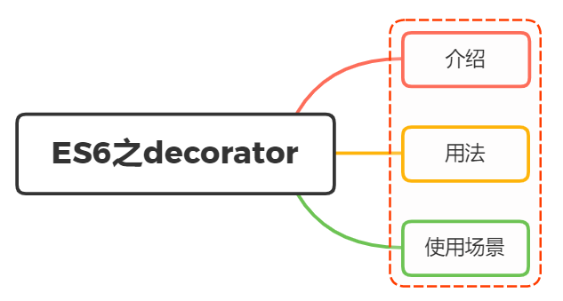

# 面试官：你是怎么理解ES6中 Decorator 的？使用场景？

 

## 一、介绍

Decorator，即装饰器，从名字上很容易让我们联想到装饰者模式

简单来讲，装饰者模式就是一种在不改变原类和使用继承的情况下，动态地扩展对象功能的设计理论。

`ES6`中`Decorator`功能亦如此，其本质也不是什么高大上的结构，就是一个普通的函数，用于扩展类属性和类方法

这里定义一个士兵，这时候他什么装备都没有

```js
class soldier{ 
}
```

定义一个得到 AK 装备的函数，即装饰器

```js
function strong(target){
    target.AK = true
}
```

使用该装饰器对士兵进行增强

```js
@strong
class soldier{
}
```

这时候士兵就有武器了

```js
soldier.AK // true
```

上述代码虽然简单，但也能够清晰看到了使用`Decorator`两大优点：

- 代码可读性变强了，装饰器命名相当于一个注释
- 在不改变原有代码情况下，对原来功能进行扩展


## 二、用法

`Docorator`修饰对象为下面两种：

- 类的装饰
- 类属性的装饰

### 类的装饰

当对类本身进行装饰的时候，能够接受一个参数，即类本身

将装饰器行为进行分解，大家能够有个更深入的了解

```js
@decorator
class A {}

// 等同于

class A {}
A = decorator(A) || A;
```

下面`@testable`就是一个装饰器，`target`就是传入的类，即`MyTestableClass`，实现了为类添加静态属性

```js
@testable
class MyTestableClass {
  // ...
}

function testable(target) {
  target.isTestable = true;
}

MyTestableClass.isTestable // true
```

如果想要传递参数，可以在装饰器外层再封装一层函数

```js
function testable(isTestable) {
  return function(target) {
    target.isTestable = isTestable;
  }
}

@testable(true)
class MyTestableClass {}
MyTestableClass.isTestable // true

@testable(false)
class MyClass {}
MyClass.isTestable // false
```


### 类属性的装饰

当对类属性进行装饰的时候，能够接受三个参数：

- 类的原型对象
- 需要装饰的属性名
- 装饰属性名的描述对象

首先定义一个`readonly`装饰器

```js
function readonly(target, name, descriptor){
  descriptor.writable = false; // 将可写属性设为false
  return descriptor;
}
```

使用`readonly`装饰类的`name`方法

```javascript
class Person {
  @readonly
  name() { return `${this.first} ${this.last}` }
}
```

相当于以下调用

```js
readonly(Person.prototype, 'name', descriptor);
```

如果一个方法有多个装饰器，就像洋葱一样，先从外到内进入，再由内到外执行

```javascript
function dec(id){
    console.log('evaluated', id);
    return (target, property, descriptor) =>console.log('executed', id);
}

class Example {
    @dec(1)
    @dec(2)
    method(){}
}
// evaluated 1
// evaluated 2
// executed 2
// executed 1
```

外层装饰器`@dec(1)`先进入，但是内层装饰器`@dec(2)`先执行


### 注意

装饰器不能用于修饰函数，因为函数存在变量声明情况

```js
var counter = 0;

var add = function () {
  counter++;
};

@add
function foo() {
}
```

编译阶段，变成下面

```js
var counter;
var add;

@add
function foo() {
}

counter = 0;

add = function () {
  counter++;
};
```

意图是执行后`counter`等于 1，但是实际上结果是`counter`等于 0


## 三、使用场景

基于`Decorator`强大的作用，我们能够完成各种场景的需求，下面简单列举几种：

使用`react-redux`的时候，如果写成下面这种形式，既不雅观也很麻烦

```js
class MyReactComponent extends React.Component {}

export default connect(mapStateToProps, mapDispatchToProps)(MyReactComponent);
```

通过装饰器就变得简洁多了

```js
@connect(mapStateToProps, mapDispatchToProps)
export default class MyReactComponent extends React.Component {}
```

将`mixins`，也可以写成装饰器，让使用更为简洁了

```js
function mixins(...list) {
  return function (target) {
    Object.assign(target.prototype, ...list);
  };
}

// 使用
const Foo = {
  foo() { console.log('foo') }
};

@mixins(Foo)
class MyClass {}

let obj = new MyClass();
obj.foo() // "foo"
```


下面再讲讲`core-decorators.js`几个常见的装饰器

#### @antobind

`autobind`装饰器使得方法中的`this`对象，绑定原始对象

```javascript
import { autobind } from 'core-decorators';

class Person {
  @autobind
  getPerson() {
    return this;
  }
}

let person = new Person();
let getPerson = person.getPerson;

getPerson() === person;
// true
```


#### @readonly

`readonly`装饰器使得属性或方法不可写

```javascript
import { readonly } from 'core-decorators';

class Meal {
  @readonly
  entree = 'steak';
}

var dinner = new Meal();
dinner.entree = 'salmon';
// Cannot assign to read only property 'entree' of [object Object]
```


#### @deprecate

`deprecate`或`deprecated`装饰器在控制台显示一条警告，表示该方法将废除

```javascript
import { deprecate } from 'core-decorators';

class Person {
  @deprecate
  facepalm() {}

  @deprecate('功能废除了')
  facepalmHard() {}
}

let person = new Person();

person.facepalm();
// DEPRECATION Person#facepalm: This function will be removed in future versions.

person.facepalmHard();
// DEPRECATION Person#facepalmHard: 功能废除了

```


## 参考文献

- https://es6.ruanyifeng.com/#docs/decorator