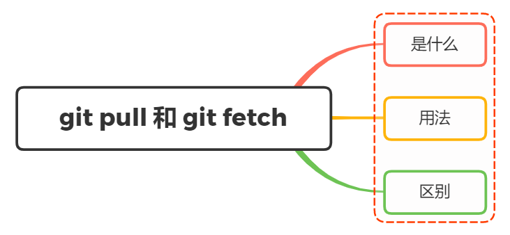
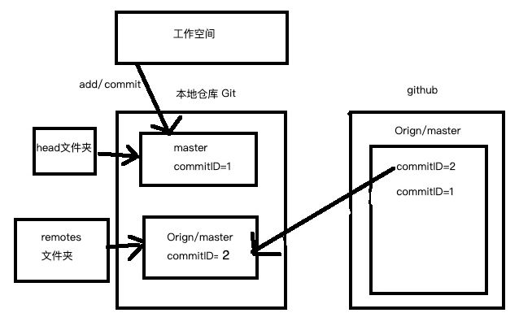
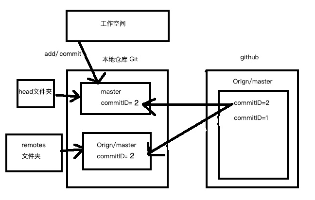

# 说说对git pull 和 git fetch 的理解？有什么区别？

 


## 一、是什么
先回顾两个命令的定义
- git fetch 命令用于从另一个存储库下载对象和引用
- git pull 命令用于从另一个存储库或本地分支获取并集成(整合)

再来看一次`git`的工作流程图，如下所示：

 

可以看到，`git fetch`是将远程主机的最新内容拉到本地，用户在检查了以后决定是否合并到工作本机分支中

而`git pull` 则是将远程主机的最新内容拉下来后直接合并，即：`git pull = git fetch + git merge`，这样可能会产生冲突，需要手动解决

在我们本地的`git`文件中对应也存储了`git`本地仓库分支的`commit ID `和 跟踪的远程分支的`commit ID`，对应文件如下：

-  .git/refs/head/[本地分支]
-  .git/refs/remotes/[正在跟踪的分支]

使用 `git fetch`更新代码，本地的库中`master`的`commitID`不变

但是与`git`上面关联的那个`orign/master`的`commit ID`发生改变

这时候我们本地相当于存储了两个代码的版本号，我们还要通过`merge`去合并这两个不同的代码版本

 

也就是`fetch`的时候本地的`master`没有变化，但是与远程仓关联的那个版本号被更新了，接下来就是在本地`merge`合并这两个版本号的代码

相比之下，使用`git pull`就更加简单粗暴，会将本地的代码更新至远程仓库里面最新的代码版本，如下图：

 


## 二、用法

一般远端仓库里有新的内容更新，当我们需要把新内容下载的时候，就使用到`git pull`或者`git fetch`命令

### fetch

用法如下：

```cmd
git fetch <远程主机名> <远程分支名>:<本地分支名>
```

例如从远程的`origin`仓库的`master`分支下载代码到本地并新建一个`temp`分支

```cmd
git fetch origin master:temp
```

如果上述没有冒号，则表示将远程`origin`仓库的`master`分支拉取下来到本地当前分支

这里`git fetch`不会进行合并，执行后需要手动执行`git merge`合并，如下：

```cmd
git merge temp
```


### pull

两者的用法十分相似，`pull`用法如下：

```cmd
git pull <远程主机名> <远程分支名>:<本地分支名>
```

例如将远程主机`origin`的`master`分支拉取过来，与本地的`branchtest`分支合并，命令如下：

```cmd
git pull origin master:branchtest
```

同样如果上述没有冒号，则表示将远程`origin`仓库的`master`分支拉取下来与本地当前分支合并


## 三、区别

相同点：

- 在作用上他们的功能是大致相同的，都是起到了更新代码的作用

不同点：

- git pull是相当于从远程仓库获取最新版本，然后再与本地分支merge，即git pull = git fetch + git merge
- 相比起来，git fetch 更安全也更符合实际要求，在 merge 前，我们可以查看更新情况，根据实际情况再决定是否合并


## 参考文献

- https://zhuanlan.zhihu.com/p/123370920
- https://segmentfault.com/a/1190000017030384
- https://juejin.cn/post/6844903921794859021
