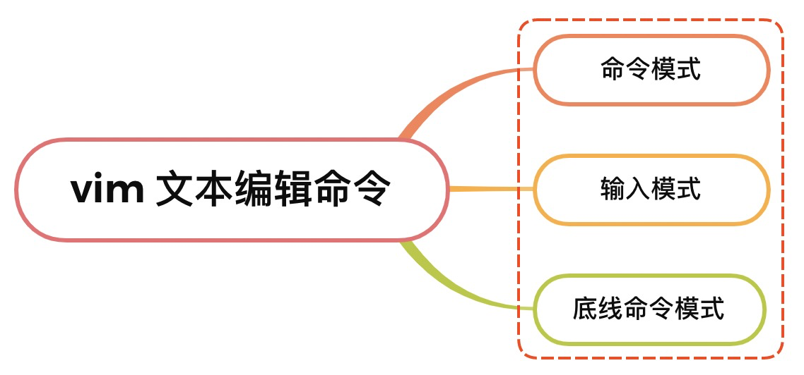
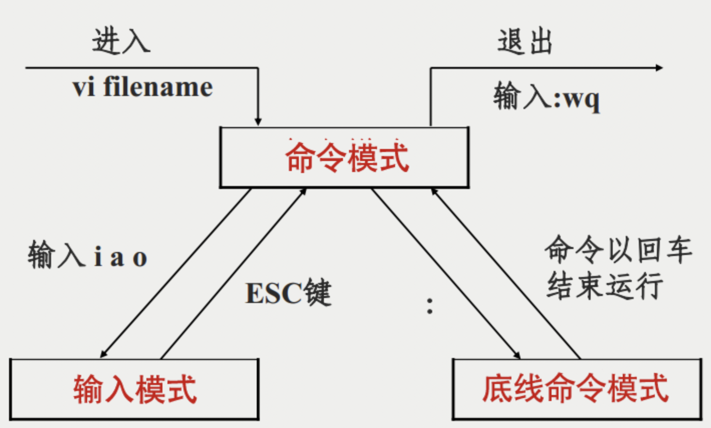

# 面试官：说说 linux 系统下 文本编辑常用的命令有哪些？

 

## 一、是什么

`Vim`是从 `vi` 发展出来的一个文本编辑器，代码补全、编译及错误跳转等方便编程的功能特别丰富，在程序员中被广泛使用。

简单的来说， `vi` 是老式的字处理器，不过功能已经很齐全了，但是还是有可以进步的地方

而`vim `可以说是程序开发者的一项很好用的工具

## 二、使用

基本上 vi/vim 共分为三种模式，分别是：

- 命令模式（Command mode）
- 输入模式（Insert mode）
- 底线命令模式（Last line mode）

 

### 命令模式

`Vim` 的默认模式，在这个模式下，你不能输入文本，但是可以让我们在文本间移动，删除一行文本，复制黏贴文本，跳转到指定行，撤销操作，等等

#### 移动光标

常用的命令如下：

- h 向左移动一个字符
- j 向下移动一个字符
- k 向上移动一个字符
- i 向右移动一个字符

或者使用方向键进行控制

如果想要向下移动`n`行，可通过使用 "nj" 或 "n↓" 的组合按键

#### 搜索

常见的命令如下：

- /word：向光标之下寻找一个名称为 word 的字符

- ?word：向光标之上寻找一个字符串名称为 word 的字符串
- n：代表重复前一个搜寻的动作，即再次执行上一次的操作
- N：反向进行前一个搜索动作

#### 删除、复制、粘贴

常用的命令如下：

- x：向后删除一个字符
- X：向前删除一个字符
- nc：n 为数字，连续向后删除 n 个字符
- dd：删除游标所在的那一整行
- d0：删除游标所在处，到该行的最前面一个字符
- d$删除游标所在处，到该行的最后一个字符
- ndd：除光标所在的向下 n 行
- yy：复制游标所在的那一行
- y0：复制光标所在的那个字符到该行行首的所有数据
- y$：复制光标所在的那个字符到该行行尾的所有数据
- p：已复制的数据在光标下一行贴上
- P：已复制的数据在光标上一行贴上
- nc：重复删除n行数据

### 输入模式

命令模式通过输入大小写`i`、`a`、`o`可以切换到输入模式，如下：

- i：从目前光标所在处输入
- I：在目前所在行的第一个非空格符处开始输入
- a：从目前光标所在的下一个字符处开始输入
- A：从光标所在行的最后一个字符处开始输入
- o：在目前光标所在的下一行处输入新的一行
- O：目前光标所在的上一行处输入新的一行

输入模式我们熟悉的文本编辑器的模式，就是可以输入任何你想输入的内容

如果想从插入模式回到命令模式，使用按下键盘左上角的`ESC`键

### 底线命令模式

这个模式下可以运行一些命令例如“退出”，“保存”，等动作，为了进入底线命令模式，首先要进入命令模式，再按下冒号键：

常见的命令如下：

- w：将编辑的数据写入硬盘档案中
- w!：若文件属性为『只读』时，强制写入该档案
- q：未修改，直接退出
- q!：修改过但不存储
- wq：储存后离开

## 参考文献

- https://www.runoob.com/linux/linux-vim.html